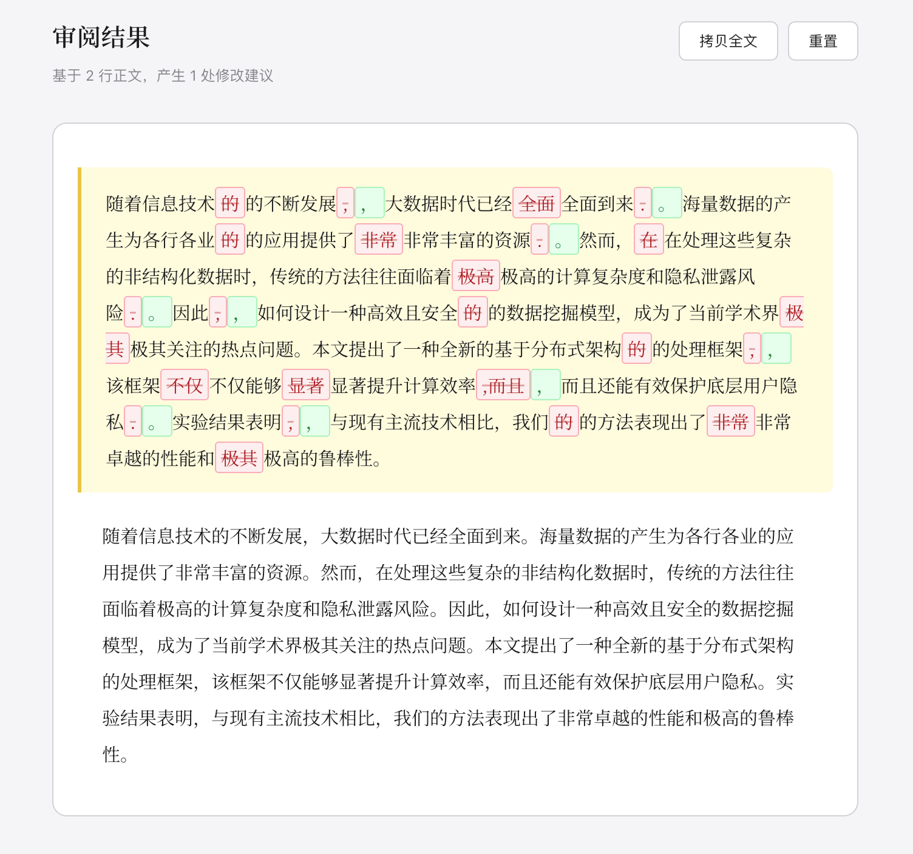

# 抠字儿

一个极简的 AI 论文、长文本校对工具。单文件静态 HTML 实现，粘贴文本，静候 AI 逐行抠出语病与错别字。

## 示例效果


## 使用方式
1. 下载并在电脑双击打开index.html

2. 点击配置

3. 输入你的API

4. （务必）从你的word里复制纯文本内容，粘贴至页面内

5. 点击「开始校对」

## 局限
1. 目前输入框只支持纯文本粘贴，论文中排版复杂的数学公式如果强行粘贴，会产生字符丢失。这容易导致 AI 产生“此处缺少字符”或“前后文不搭”的误判。
2. AI 是很好的助理，但不是最终的法官。校对结果有时会存在过度修改个人表达习惯的情况，请在使用时将其视为**参考建议**并自行甄别。

## 测试用例

<details>
<summary>点击展开测试文本</summary>
<br>

```text
随着信息技术的的不断发展,大数据时代已经全面全面到来.海量数据的产生为各行各业的的应用提供了非常非常丰富的资源.然而，在在处理这些复杂的非结构化数据时，传统的方法往往面临着极高极高的计算复杂度和隐私泄露风险.因此,如何设计一种高效且安全的的数据挖掘模型，成为了当前学术界极其极其关注的热点问题。本文提出了一种全新的基于分布式架构的的处理框架,该框架不仅不仅能够显著显著提升计算效率,而且而且还能有效保护底层用户隐私.实验结果表明,与现有主流技术相比，我们的的方法表现出了非常非常卓越的性能和极其极高的鲁棒性。
```
</details>

## 免责声明
本工具为个人开发的轻量 Demo，仅供辅助参考，请谨慎使用校对结果。页面为纯静态 HTML，不会保存任何用户数据——你的文本仅在校对时逐段发送至所配置的 AI 模型进行检测。此外，由于公式无法以纯文本形式粘贴，包含公式的段落可能被 AI 误判为"缺少字符"，此类修改建议需自行甄别。

---

<p align="center">
  如果这个极简的小工具恰好帮助到了你，欢迎留下 <strong>Star 🌟</strong><br>
  <sub>Built with ❤️ by <a href="https://github.com/may3rr">jackielyu</a></sub>
</p>